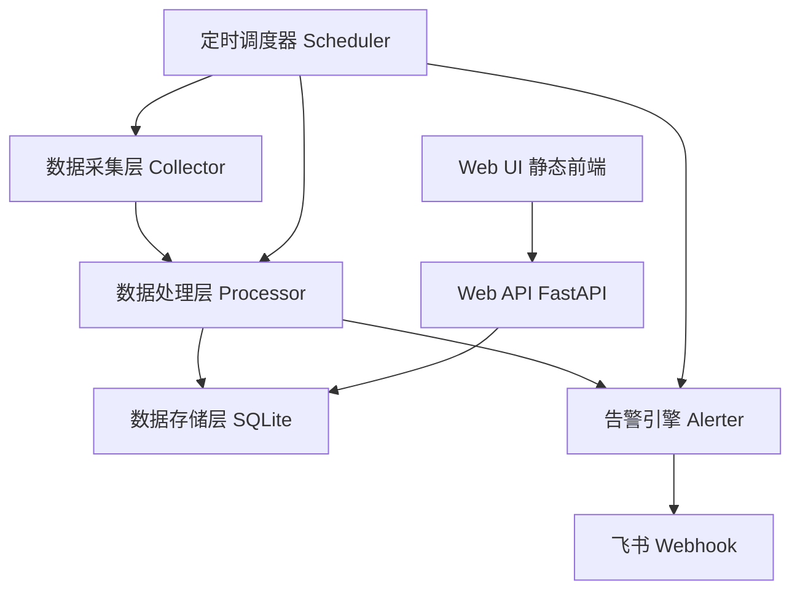
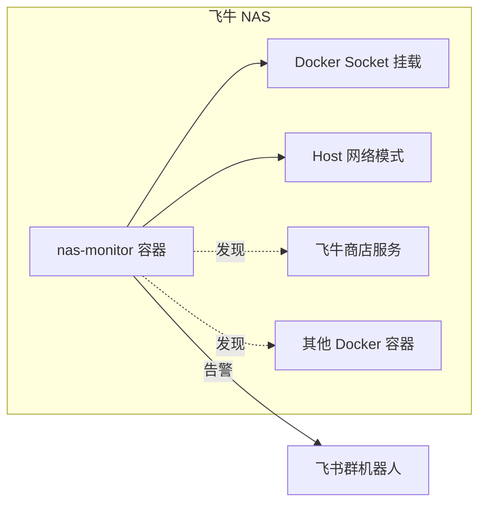
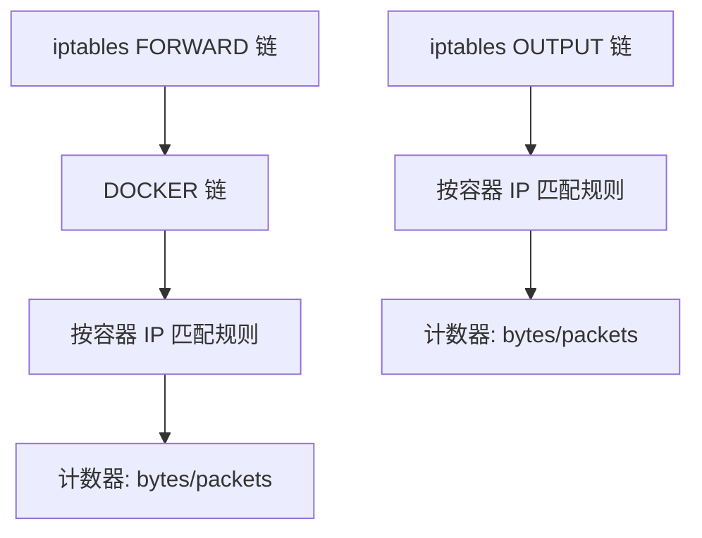

# NAS 流量监控与告警系统

Feature Name: nas-traffic-monitor
Updated: 2026-04-18

## Description

部署在飞牛 NAS 上的轻量级网络流量监控与告警系统。自动发现 NAS 上所有服务（飞牛商店应用 + Docker 容器），按服务统计上下行流量（区分局域网/互联网），监控连接数，生成每日汇总报告，并在流量或连接异常时通过飞书 Webhook 发送告警。提供 Web 管理界面供查看和配置。

## Architecture



### 整体架构

系统采用三层架构，以 Python 后端为核心：

1. **数据采集层**：通过系统命令和 API 采集服务信息、流量数据和连接数
2. **数据处理层**：清洗、聚合采集数据，计算流量差值，执行异常检测
3. **Web 展示层**：FastAPI 提供 REST API，前端展示仪表盘和配置页面

### 部署架构



系统本身以 Docker 容器方式部署，使用 host 网络模式以访问宿主机的网络统计数据，挂载 Docker Socket 以发现容器服务。

## Components and Interfaces

### 1. Scheduler - 定时调度器

**职责**：按配置的时间间隔调度各采集和处理任务。

| 任务 | 执行间隔 | 说明 |
|------|----------|------|
| service_discovery | 5 分钟 | 发现新服务/更新服务状态 |
| traffic_collect | 5 分钟 | 采集流量数据 |
| connection_collect | 5 分钟 | 采集连接数数据 |
| daily_summary | 每日 00:05 | 生成前一日汇总 |
| alert_check | 5 分钟 | 检查异常并触发告警 |
| data_cleanup | 每日 01:00 | 清理超过 90 天的原始数据 |

**实现**：使用 APScheduler 库的 BackgroundScheduler。

### 2. Collector - 数据采集器

#### 2.1 ServiceDiscovery - 服务发现

```python
class ServiceInfo:
    service_id: str          # 唯一标识，格式: "fnstore-{name}" 或 "docker-{container_id[:12]}"
    name: str                # 服务显示名称
    source: str              # "fnstore" | "docker"
    status: str              # "running" | "stopped"
    container_id: str | None # Docker 容器 ID（仅 Docker 服务）
    image: str | None        # 镜像名称（仅 Docker 服务）
    ports: list[str]         # 端口映射列表
    pid: int | None          # 主进程 PID
    created_at: datetime     # 首次发现时间
    updated_at: datetime     # 最后更新时间
```

**采集方式**：

| 来源 | 采集方式 | 命令/API |
|------|----------|----------|
| Docker 容器 | Docker API | `docker ps -a --format json` 或 Docker SDK |
| 飞牛商店服务 | 飞牛 CLI/API | `fnstore list`（需验证实际命令） |

> 注：飞牛商店服务的发现需要根据实际飞牛 OS 版本确定可用 API。如无官方 API，则通过进程名+端口关联。

#### 2.2 TrafficCollector - 流量采集

**核心原理**：使用 iptables 统计流量，按服务（Docker 容器或进程）创建独立的计数链。

**Docker 容器流量采集方案**：



1. 为每个 Docker 容器，根据其虚拟网卡 IP 在 iptables 中添加统计规则
2. 区分局域网/互联网：通过 `-d` 匹配目标 IP 段
   - 局域网：`-d 10.0.0.0/8 -d 172.16.0.0/12 -d 192.168.0.0/16`
   - 互联网：非上述网段（使用 `! -d` 排除私有地址）
3. 每次采集时读取计数器值，与上次采集的值做差值计算周期内流量

**非容器服务流量采集方案**：

对于飞牛商店安装的非容器服务，通过进程 PID + cgroup 方式采集：

1. 获取服务主进程 PID
2. 读取 `/proc/{pid}/net/dev` 获取网络设备统计
3. 或使用 `nethogs` 按进程统计流量（需要安装）
4. 备选方案：通过服务监听端口 + `ss` 命令关联流量

**流量数据结构**：

```python
class TrafficRecord:
    id: int
    service_id: str
    timestamp: datetime
    lan_rx_bytes: int       # 局域网下行字节数
    lan_tx_bytes: int       # 局域网上行字节数
    wan_rx_bytes: int       # 互联网下行字节数
    wan_tx_bytes: int       # 互联网上行字节数
```

#### 2.3 ConnectionCollector - 连接数采集

**采集方式**：通过 `ss` 命令获取网络连接信息。

```bash
# 获取所有 TCP/UDP 连接及关联进程
ss -tunap
```

**处理逻辑**：

1. 执行 `ss -tunap` 获取所有连接
2. 按进程 PID 关联到对应服务
3. 根据 remote IP 判断局域网/互联网
4. 按服务聚合统计连接数

**连接数数据结构**：

```python
class ConnectionRecord:
    id: int
    service_id: str
    timestamp: datetime
    lan_connections: int    # 局域网连接数
    wan_connections: int    # 互联网连接数
```

### 3. Processor - 数据处理器

#### 3.1 DataAggregator - 数据聚合

- 将采集的原始计数器差值计算为周期内流量
- 每日汇总：按天聚合各服务的流量和连接数
- 生成每日汇总记录

```python
class DailySummary:
    id: int
    date: date
    service_id: str
    lan_rx_bytes: int
    lan_tx_bytes: int
    wan_rx_bytes: int
    wan_tx_bytes: int
    peak_wan_connections: int      # 当日互联网连接数峰值
    avg_wan_connections: float     # 当日互联网连接数均值
```

#### 3.2 AlertEngine - 告警引擎

**告警规则**：

| 规则 ID | 指标 | 条件 | 默认阈值 |
|---------|------|------|----------|
| high_upload | 互联网上行流量 | 1 小时内累计 > 阈值 | 5 GB |
| high_download | 互联网下行流量 | 1 小时内累计 > 阈值 | 10 GB |
| high_connections | 互联网连接数 | 单次采集 > 阈值 | 200 |

**告警去重**：同一服务同一规则在 30 分钟内只触发一次告警。

**告警数据结构**：

```python
class AlertRecord:
    id: int
    service_id: str
    rule_id: str
    triggered_at: datetime
    metric_value: float
    threshold: float
    message: str
    notified: bool           # 是否已发送飞书通知
```

### 4. Notifier - 通知器

**飞书 Webhook 通知**：

```python
class FeishuNotifier:
    webhook_url: str

    async def send_alert(alert: AlertRecord, service: ServiceInfo) -> None:
        """发送告警消息到飞书群"""
        # 构建飞书消息卡片 JSON
        # POST 到 webhook_url
```

**消息格式**：使用飞书消息卡片，包含：
- 告警级别（警告/严重）
- 服务名称
- 异常指标和当前值
- 阈值
- 触发时间

### 5. Auth - 认证模块

**技术方案**：JWT Token 认证。

**认证流程**：


**实现细节**：

- 使用 `python-jose` 库生成和验证 JWT
- 密码使用 `bcrypt` 哈希存储
- Token 有效期 24 小时
- 通过 FastAPI 的 `Depends` 机制实现全局鉴权中间件
- 登录接口和静态资源不需要 Token

**认证相关 API**：

| 端点 | 方法 | 说明 | 认证 |
|------|------|------|------|
| `/api/auth/login` | POST | 用户登录，返回 JWT Token | 无需 |
| `/api/auth/password` | PUT | 修改当前用户密码 | 需要 |
| `/api/auth/info` | GET | 获取当前用户信息 | 需要 |

**数据库表**：

```sql
CREATE TABLE users (
    id INTEGER PRIMARY KEY AUTOINCREMENT,
    username TEXT NOT NULL UNIQUE,
    password_hash TEXT NOT NULL,
    created_at TEXT NOT NULL,
    updated_at TEXT NOT NULL
);
```

**首次部署初始化**：通过环境变量 `ADMIN_USERNAME` 和 `ADMIN_PASSWORD` 设置默认管理员账号，容器首次启动时自动创建。

### 6. Web API - FastAPI 接口

| 端点 | 方法 | 说明 | 认证 |
|------|------|------|------|
| `/api/auth/login` | POST | 用户登录 | 无需 |
| `/api/auth/password` | PUT | 修改密码 | 需要 |
| `/api/auth/info` | GET | 当前用户信息 | 需要 |
| `/api/services` | GET | 获取所有服务列表及状态 | 需要 |
| `/api/services/{id}/traffic` | GET | 获取指定服务流量数据 | 需要 |
| `/api/services/{id}/connections` | GET | 获取指定服务连接数数据 | 需要 |
| `/api/daily-summary` | GET | 获取每日汇总列表 | 需要 |
| `/api/daily-summary/{date}` | GET | 获取指定日期汇总详情 | 需要 |
| `/api/alerts` | GET | 获取告警记录 | 需要 |
| `/api/alerts/config` | GET | 获取告警配置 | 需要 |
| `/api/alerts/config` | PUT | 更新告警配置 | 需要 |
| `/api/settings/webhook` | GET | 获取飞书 Webhook 配置 | 需要 |
| `/api/settings/webhook` | PUT | 更新飞书 Webhook 配置 | 需要 |
| `/api/settings/webhook/test` | POST | 测试飞书 Webhook 连通性 | 需要 |
| `/api/dashboard` | GET | 仪表盘聚合数据 | 需要 |

### 6. Web UI - 前端界面

**技术选型**：纯静态 HTML + CSS + JavaScript，使用 Chart.js 绘制图表，无需 Node.js 构建。

**认证前端逻辑**：

1. 登录页面：用户名 + 密码表单，调用 `/api/auth/login` 获取 Token
2. Token 存储：使用 `localStorage` 存储 JWT Token
3. 请求拦截：所有 API 请求自动附加 `Authorization: Bearer <token>` 头
4. Token 过期处理：API 返回 401 时，自动跳转到登录页
5. 路由守卫：未登录时所有页面重定向到登录页

**页面结构**：

| 页面 | 路径 | 说明 |
|------|------|------|
| 登录 | `/login` | 用户名密码登录 |
| 仪表盘 | `/` | 总览：全局流量、活跃服务、最近告警 |
| 服务列表 | `/services` | 所有服务及当前状态 |
| 服务详情 | `/services/{id}` | 单个服务的流量和连接数详情 |
| 每日汇总 | `/summary` | 每日流量汇总报表 |
| 告警记录 | `/alerts` | 历史告警列表 |
| 系统设置 | `/settings` | 告警阈值、Webhook 配置、修改密码 |

## Data Models

### SQLite 表结构

```sql
CREATE TABLE users (
    id INTEGER PRIMARY KEY AUTOINCREMENT,
    username TEXT NOT NULL UNIQUE,
    password_hash TEXT NOT NULL,
    created_at TEXT NOT NULL,
    updated_at TEXT NOT NULL
);

CREATE TABLE services (
    service_id TEXT PRIMARY KEY,
    name TEXT NOT NULL,
    source TEXT NOT NULL,        -- 'fnstore' | 'docker'
    status TEXT NOT NULL,        -- 'running' | 'stopped'
    container_id TEXT,           -- Docker 容器 ID
    image TEXT,                  -- Docker 镜像
    ports TEXT,                  -- JSON 数组: ["8080:80", "443:443"]
    pid INTEGER,                 -- 主进程 PID
    created_at TEXT NOT NULL,    -- ISO8601
    updated_at TEXT NOT NULL     -- ISO8601
);

CREATE TABLE traffic_records (
    id INTEGER PRIMARY KEY AUTOINCREMENT,
    service_id TEXT NOT NULL,
    timestamp TEXT NOT NULL,     -- ISO8601
    lan_rx_bytes INTEGER NOT NULL DEFAULT 0,
    lan_tx_bytes INTEGER NOT NULL DEFAULT 0,
    wan_rx_bytes INTEGER NOT NULL DEFAULT 0,
    wan_tx_bytes INTEGER NOT NULL DEFAULT 0,
    FOREIGN KEY (service_id) REFERENCES services(service_id)
);

CREATE INDEX idx_traffic_service_time ON traffic_records(service_id, timestamp);

CREATE TABLE connection_records (
    id INTEGER PRIMARY KEY AUTOINCREMENT,
    service_id TEXT NOT NULL,
    timestamp TEXT NOT NULL,     -- ISO8601
    lan_connections INTEGER NOT NULL DEFAULT 0,
    wan_connections INTEGER NOT NULL DEFAULT 0,
    FOREIGN KEY (service_id) REFERENCES services(service_id)
);

CREATE INDEX idx_conn_service_time ON connection_records(service_id, timestamp);

CREATE TABLE daily_summaries (
    id INTEGER PRIMARY KEY AUTOINCREMENT,
    date TEXT NOT NULL,          -- YYYY-MM-DD
    service_id TEXT NOT NULL,
    lan_rx_bytes INTEGER NOT NULL DEFAULT 0,
    lan_tx_bytes INTEGER NOT NULL DEFAULT 0,
    wan_rx_bytes INTEGER NOT NULL DEFAULT 0,
    wan_tx_bytes INTEGER NOT NULL DEFAULT 0,
    peak_wan_connections INTEGER NOT NULL DEFAULT 0,
    avg_wan_connections REAL NOT NULL DEFAULT 0,
    FOREIGN KEY (service_id) REFERENCES services(service_id),
    UNIQUE(date, service_id)
);

CREATE INDEX idx_summary_date ON daily_summaries(date);

CREATE TABLE alert_records (
    id INTEGER PRIMARY KEY AUTOINCREMENT,
    service_id TEXT NOT NULL,
    rule_id TEXT NOT NULL,
    triggered_at TEXT NOT NULL,   -- ISO8601
    metric_value REAL NOT NULL,
    threshold REAL NOT NULL,
    message TEXT NOT NULL,
    notified INTEGER NOT NULL DEFAULT 0,
    FOREIGN KEY (service_id) REFERENCES services(service_id)
);

CREATE INDEX idx_alerts_time ON alert_records(triggered_at);

CREATE TABLE alert_config (
    rule_id TEXT PRIMARY KEY,
    service_id TEXT,              -- NULL 表示全局默认
    metric TEXT NOT NULL,         -- 'wan_tx_bytes_1h' | 'wan_rx_bytes_1h' | 'wan_connections'
    threshold REAL NOT NULL,
    window_minutes INTEGER NOT NULL DEFAULT 60,
    enabled INTEGER NOT NULL DEFAULT 1
);

CREATE TABLE settings (
    key TEXT PRIMARY KEY,
    value TEXT NOT NULL
);

-- 默认告警配置
INSERT INTO alert_config (rule_id, service_id, metric, threshold, window_minutes) VALUES
    ('high_upload', NULL, 'wan_tx_bytes_1h', 5368709120, 60),    -- 5 GB
    ('high_download', NULL, 'wan_rx_bytes_1h', 10737418240, 60),  -- 10 GB
    ('high_connections', NULL, 'wan_connections', 200, 5);
```

### 数据保留策略

- **原始数据**（traffic_records, connection_records）：保留 90 天，每日 01:00 由 data_cleanup 任务清理
- **汇总数据**（daily_summaries）：永久保留
- **告警记录**（alert_records）：保留 180 天
- **服务信息**（services）：持续更新，标记离线但保留记录

## Correctness Properties

1. **流量计数器单调性**：iptables 计数器只增不减，两次采集的差值必须 >= 0；若出现负值（计数器重置），应丢弃该次差值并记录日志
2. **数据完整性**：每个 5 分钟采集周期必须为所有运行中服务生成记录，缺失的周期用零值填充
3. **告警去重**：同一服务同一规则在 30 分钟内最多触发一次告警
4. **服务标识唯一性**：service_id 必须全局唯一，Docker 容器重启后 container_id 变化时仍使用同一 service_id（基于容器名称）
5. **汇总数据一致性**：daily_summaries 中的流量值必须等于当日所有 5 分钟记录的累加

## Error Handling

| 场景 | 处理方式 |
|------|----------|
| iptables 命令执行失败 | 记录错误日志，跳过本次采集，不写入零值数据 |
| Docker API 不可达 | 记录错误日志，仅采集飞牛商店服务和已有记录的服务 |
| 飞书 Webhook 发送失败 | 记录错误日志，标记 notified=0，下次 alert_check 时重试 |
| SQLite 写入失败 | 记录错误日志，重试一次，仍失败则跳过本次写入 |
| 服务进程 PID 变化 | 按容器名称/服务名称关联，PID 变化不影响 service_id |
| iptables 计数器重置 | 检测到差值为负时丢弃本次数据，记录日志 |

## Test Strategy

### 单元测试

| 模块 | 测试内容 |
|------|----------|
| ServiceDiscovery | 模拟 Docker API 返回，验证服务列表解析 |
| TrafficCollector | 模拟 iptables 输出，验证流量差值计算 |
| ConnectionCollector | 模拟 ss 命令输出，验证连接数统计 |
| AlertEngine | 验证阈值判断、去重逻辑 |
| DataAggregator | 验证每日汇总计算正确性 |
| FeishuNotifier | Mock HTTP 请求，验证消息格式 |

### 集成测试

| 场景 | 测试方式 |
|------|----------|
| 完整采集流程 | 在测试环境启动 Docker 容器，执行一轮采集并验证数据库记录 |
| 告警触发 | 设置极低阈值，验证告警触发和飞书通知 |
| 数据清理 | 插入 90+ 天前的数据，执行清理任务后验证数据已被删除 |

### 部署验证

在飞牛 NAS 上实际部署后验证：
1. 服务发现准确性（对比 `docker ps` 和飞牛商店列表）
2. 流量数据合理性（对比 `vnstat` 全局统计）
3. 连接数准确性（对比 `ss` 命令输出）
4. 告警触发和飞书通知可达性

## References

[^1]: Docker SDK for Python - https://docker-py.readthedocs.io/
[^2]: iptables 流量统计 - Linux 内核网络子系统文档
[^3]: 飞书自定义机器人 Webhook - https://open.feishu.cn/document/client-docs/bot-v3/add-custom-bot
[^4]: APScheduler - https://apscheduler.readthedocs.io/
[^5]: FastAPI - https://fastapi.tiangolo.com/
